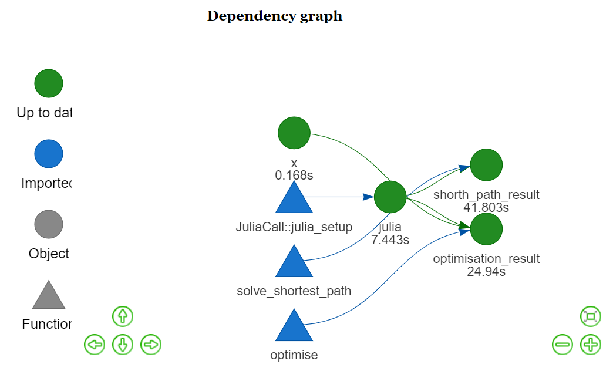

<!-- README.md is generated from README.Rmd. Please edit that file -->

# DrakeCallJulia

<!-- badges: start -->
<!-- badges: end -->

The goal of `DrakeCallJulia` is to create a toy example of how Julia and
R can be used together in a [Drake](https://github.com/ropensci/drake)
project using the
[JuliaCall](https://github.com/Non-Contradiction/JuliaCall) R package
and the [RCall](https://github.com/JuliaInterop/RCall.jl) Julia package.

## Getting started

1.  Install the packages in `renv` with `renv::restore()`.
2.  Install the dependencies of DrakeCallJulia in julia by calling
    `import Pkg; Pkg.instantiate`.
3.  Complie a `sysimage` by running `generate_sysimage.jl` at the
    project root directory.
4.  Run `drake` using `drake::r_make()`.

Here is the drake graph of our drake plan:

